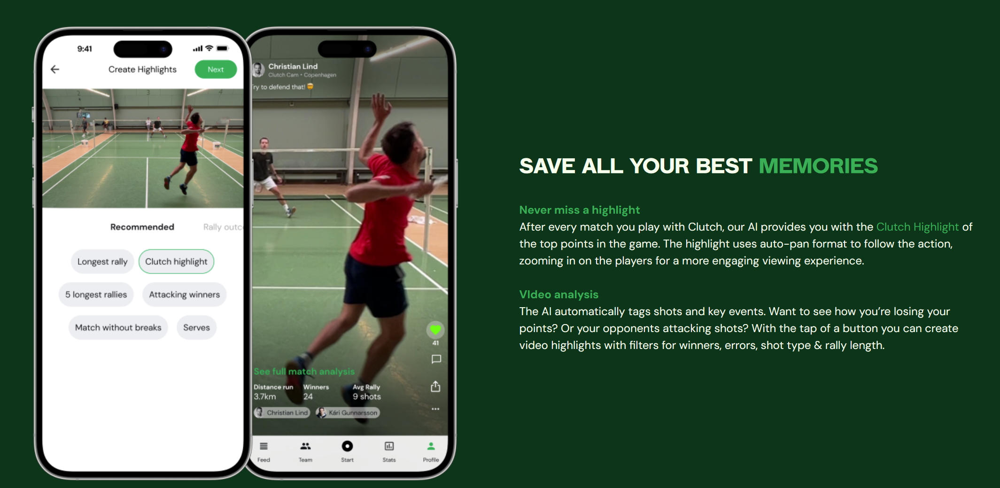
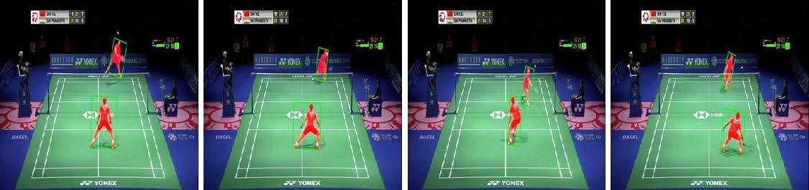
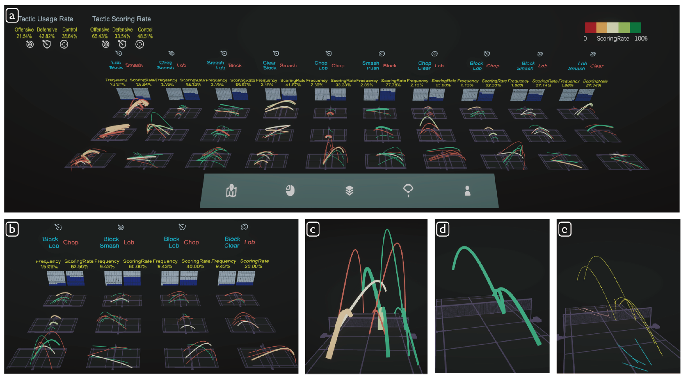
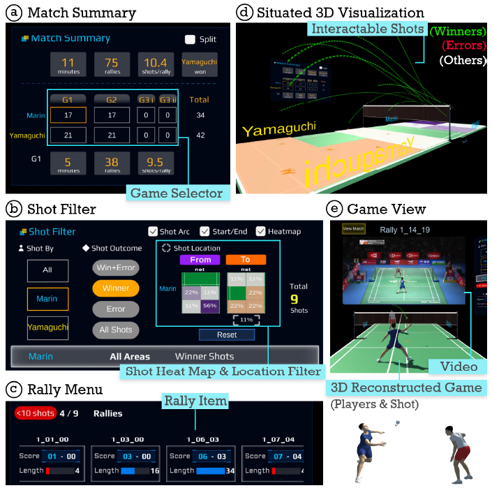
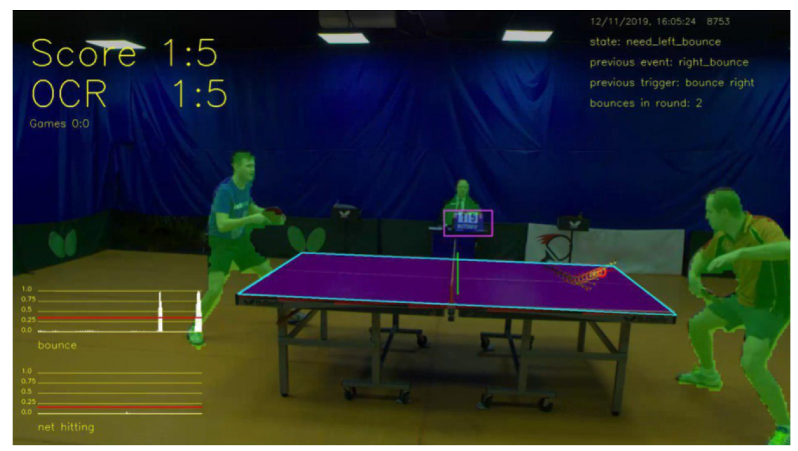
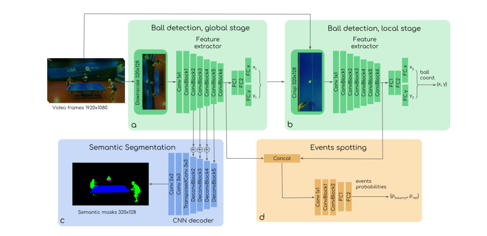

## Clutch for Badminton

### 赛后分析？

1. 高光时刻：通过yolo，SiamMask算法进行目标跟踪，捕获每一个回合选手的重心，通过前后帧各球员重心位置的变化来计算球员整体的移动平均速度，简单来看的话可以将平均速度最快的几个回合作为高光时刻（可是羽毛球可能在没有那么快的情况下也精彩）。

1. 最长多拍：主要是通过机器学习和目标检测的方法来检测击球的动作，每一次击球后++回合数。（参考TTNet）
2. 发球：通过据姿态识别，主要学习正手发球和反手发球就ok。
3. 战术分析：目前参考TIVEE和VIRD

### 实时分析？

1. 回合结束：总体而言肯定要球落地的那一帧图片，然后，这一帧往回要找到最后一次击球的动作。这样，我们得到了一段子视频，然后标注，通过深度学习，对子视频学习，让模型学习到多种情况下的正确的得分情况。（参考TTnet）
   + 最后一次击球的人失分了，可能是他没接住对面的球，
   + 最后一次击球的人失分了，可能是他出界了
   + 最后一次击球的人失分了，可能是他下网了
   + ……
2. 测速：大型比赛的测速基本都是雷达，专业测速都是高速摄像机，如果只用手机的话大概率只能通过击球瞬间的两帧测速，物理学

### qh

TTNet

基本就是预测球的位置，根据这些来预测球的位置（用了全局和截取后的球的位置，最后两个xy加权得到最终位置），进行语义分割（包括运动员，裁判，记分牌），事件推测（击球和撞网）

为了避免击球瞬间太短，用了9帧来训练。

### TrackNet

用来做轨迹分析

[GitHub - alenzenx/TrackNetV3: Beyond TrackNetV2 ,and "First" TrackNet using Attention](https://github.com/alenzenx/TrackNetV3)

[GitHub - Chang-Chia-Chi/TrackNet-Badminton-Tracking-tensorflow2: TrackNet for badminton tracking using tensorflow2](https://github.com/Chang-Chia-Chi/TrackNet-Badminton-Tracking-tensorflow2)

[GitHub - ChgygLin/TrackNetV2-pytorch: A Pytorch implementation of TrackNetV2 from Tensorflow](https://github.com/ChgygLin/TrackNetV2-pytorch/tree/main)