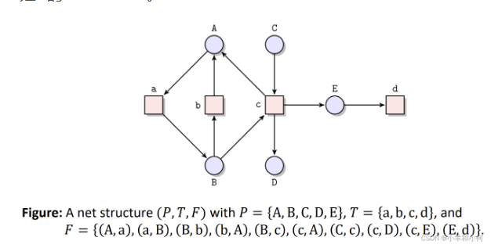
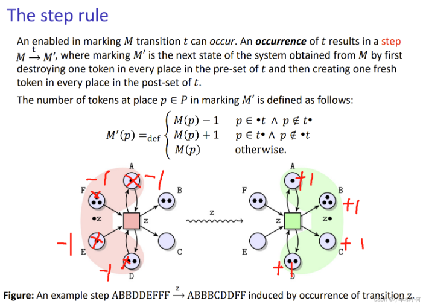
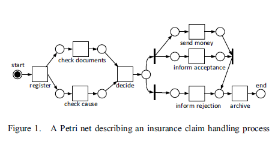
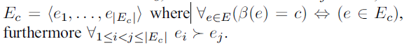
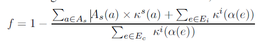
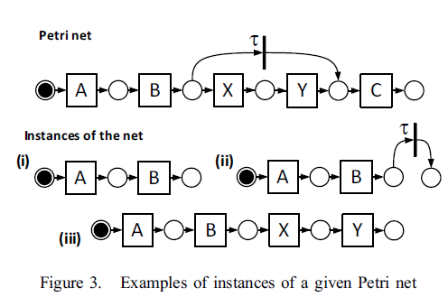
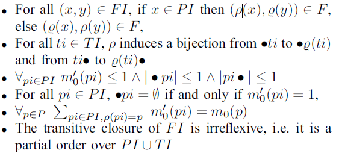
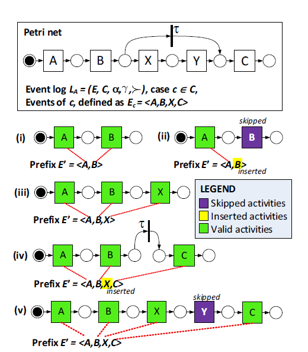

## Petri Net

#### 组件
+ Place 被动的系统组件，用圆或椭圆表示，离散状态，可以存储
+ Transition 活跃的系统组件，正方形/长方形，**每个过度会消耗，生产，转移事物**
+ Arc 不是系统组件，只是用来表示系统组件之间的逻辑关系

#### 网络结构
petri net是一个有向二边图

#### 标识
+ Tokens 代表可以被消费、生产或转移的事物，通过过度实现；可以表示一个过度所发生的必要条件。初级网络系统中只是用黑点token

### Transition条件

#### 前序节点集和后续节点集
所以在Transition前/后的Place的集合

#### Enables的条件
该Transition的所有前序节点集中每个Place所持有的token数量>=1

#### 执行流程

## A* algorithm
[RedBlobGames](https://www.redblobgames.com/pathfinding/a-star/introduction.html)
主要是评估函数：f = h + g
+ g:返回下一个结点距离源点的路径的最小距离值
+ h:启发式的函数

# Conformance Checking using *Cost-Based Fitness* Analysis

### 一致性检测
通常人工执行，手动执行的流程与日渐复杂的业务流程往往会产生偏离，因此需要这项操作
> 重要性:流程模型往往会偏离现实的流程,导致流程模型可能会是淘汰的,过时的,或者就是与现实没有联系,但是企业组织往往希望流程是**可控**和**灵活的**,也就是说在执行流程的时候允许不一致,但是要能被及时发信啊并得到相应的处理,如较为严重的应该立刻停止...

一致性检测度量过程模型相对于记录过程执行情况的事件日志的"好"的程度

### 流程模型
+ 记录业务流程
+ 配置信息系统
+ 一致性检测
+ 评估重新设计的业务流程的表现

### 两种活动
+ skipped activity 出现在流程模型中,但是没有在日志中表现
+ inserted activity 未出现在流程模型中,但是却在日志中展现
> skipped也许不会导致严重的问题,但是inserted可能会

以保险公司处理保险索赔流程展示

简单的说,对于金额较小的索赔,跳过文档检查等不是那么严重,但是跳过给钱就严重许多,相反地,对于金额大地索赔,对于文档和原因的检查就是不容许跳过的必要流程.

### 基础定义

#### 带有权值的有向图
+ 权值：非负的自然数
+ 前序/后序结点：在图的边集合中存在的前序和后续的关系
+ 路径：从src到trg，无环图
+ 路径代价函数，

#### Event Logs
+ Event
+ Case：（流程实例）都是独立的，一个实例的发生，不影响其他相同或不同的实例发生

如图，某一个case所对应的事件，这里，所有的e1-en都通过β函数都映射到case c，这里的ei->ej的顺序是固定的

#### Perfect Fit
一个case可以用petri net的一个run表达

提出知道一个事件出现偏离了是没有多大用的，要知道偏离的程度，然后了解为什么偏离发生了。这里提出插入活动和跳过活动带来影响不一样

通过两种损失函数定义这两种不同的活动影响

#### 本文提出的fitness评价指标

#### 确认两种活动
+ Instance of Petri net：需要满足一下条件

> 这里我们确认两种活动基本如下：
1. 在Prefix中出现，但是在Petri net中未出现，则认为它是***Inserted***
2. 反之，则认为其是***Skipped***

org.processmining.plugins.petrinet.replayer.costbased....